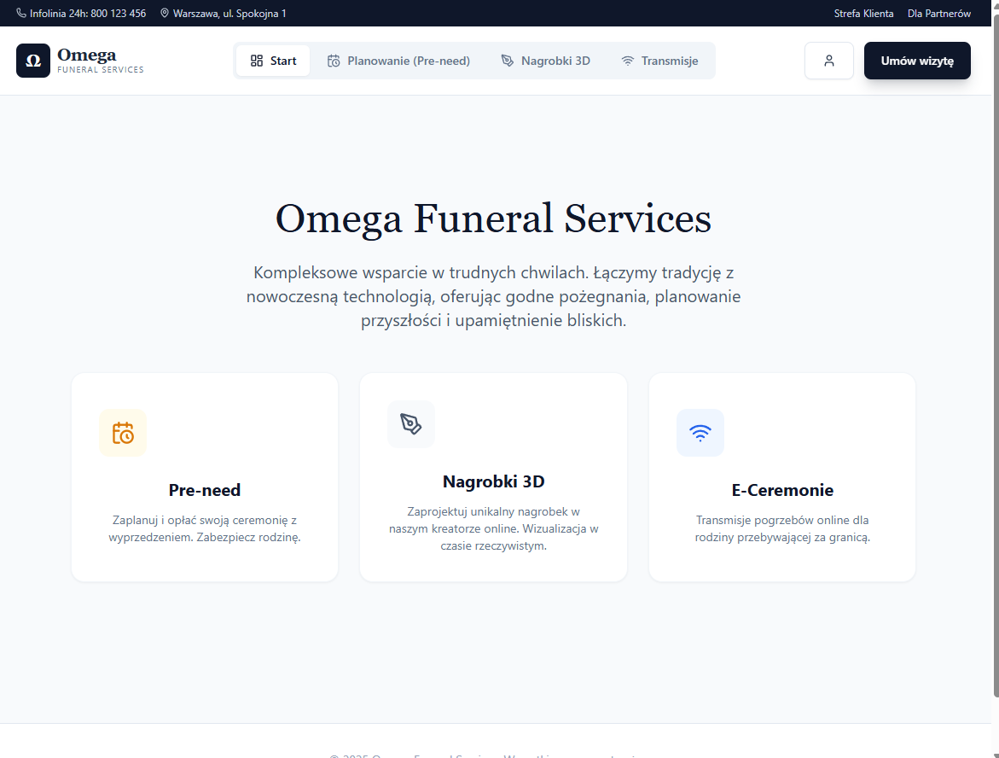
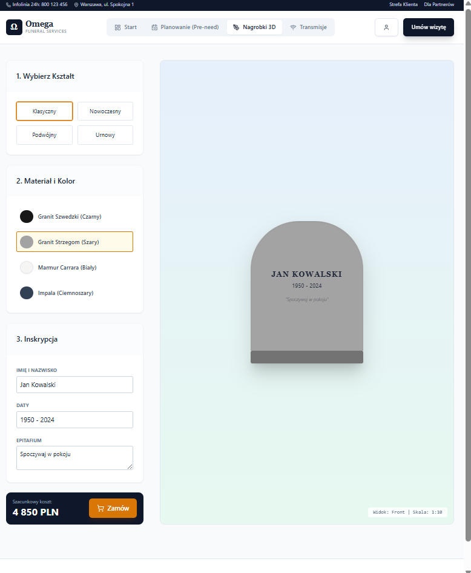
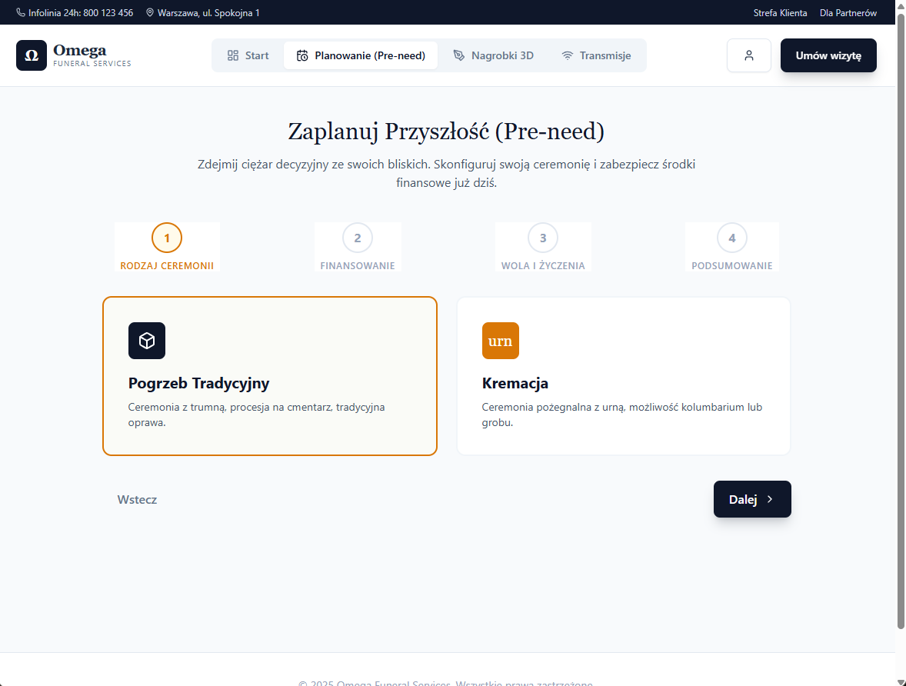
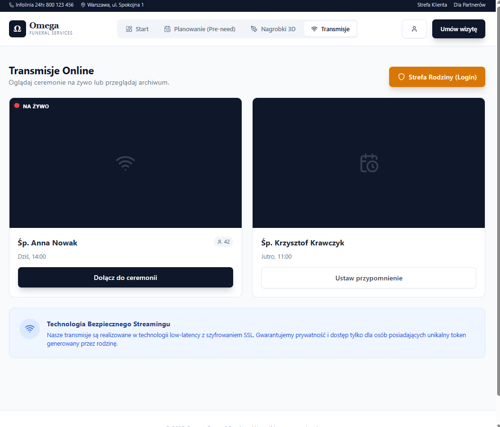

# 3. Wymagania dotyczące interfejsów zewnętrznych

## 3.1 Interfejsy użytkownika (UI)

### Założenia ogólne UI
Interfejs użytkownika ma minimalizować liczbę kroków w kluczowych procesach oraz być czytelny dla użytkowników o niskich kompetencjach cyfrowych (w tym osoby starsze). UI ma być responsywny (desktop i mobile) oraz stosować prosty język i jednoznaczne komunikaty statusów.

### Główny przypadek użycia zamodelowany w makietach
Wybrany główny przypadek użycia: „Konfiguracja i zamówienie nagrobka online wraz z akceptacją projektu”.

Makiety zawierają ścieżkę:
- Katalog → karta produktu → konfigurator → wycena → koszyk → checkout → status zamówienia → akceptacja projektu.

**Podgląd ekranów procesu:**

Link do szablonu (pełny przebieg):

### Pozostałe kluczowe ekrany (opis tekstowy, bez pełnych makiet)
A) Pre-need:
- Utworzenie planu (kroki konfiguracji usług i danych).
- Podsumowanie kosztów i status planu (draft/zaakceptowany/opłacony).
- Dokumenty i zgody.

B) Transmisje ceremonii:
- Strona dołączenia do transmisji przez prywatny link/token.
- Panel operatora: powiązanie transmisji z ceremonią, test A/V, status transmisji.
- Panel organizatora: zamówienie transmisji i wygenerowanie linku.

C) Projektowanie nagrobków online:
- Interfejs konfiguratora wizualnego (wybór kształtu, rodzaju kamienia, napisów).
- Podgląd projektu w czasie rzeczywistym.
- Dynamiczna kalkulacja ceny w zależności od wybranej konfiguracji i dodatków.

## 3.2 Interfejsy programowe (API) i integracje

### Integracja: Płatności online (wymagana dla nagrobków online; opcjonalna dla pre-need)
Cel: obsługa płatności za zamówienia (nagrobki) oraz ewentualnie opłaty za plan pre-need.

Zakres integracji:
- Utworzenie płatności dla zamówienia.
- Odbiór potwierdzenia płatności (webhook/callback).
- Obsługa statusów: rozpoczęta / opłacona / odrzucona / wygasła / zwrócona (jeśli w zakresie).
- Idempotencja: powtórzone powiadomienia z bramki płatności nie mogą powodować zdublowania opłacenia zamówienia.

Minimalny model danych (logiczny):
- order_id, amount, currency, payment_status, provider_reference, created_at, updated_at.

### Integracja: Powiadomienia e-mail/SMS (wspólna dla wszystkich modułów)
Cel: informowanie klientów i pracowników o zdarzeniach systemowych.

Przykładowe zdarzenia:
- potwierdzenie złożenia zamówienia nagrobka,
- „projekt do akceptacji” i „zaakceptowano projekt”,
- zmiana statusu zamówienia,
- link/token do transmisji ceremonii,
- potwierdzenie akceptacji planu pre-need.

Minimalne operacje:
- wysyłka wiadomości (email/SMS),
- logowanie wysyłek (status: wysłano/błąd) w celu diagnostyki.

### Integracja: Dostawca streamingu LIVE + CDN (wymagana dla modułu transmisji)
Cel: realizacja transmisji live i dystrybucja treści do uczestników z zapewnieniem jakości i skalowalności.

Zakres integracji po stronie systemu:
- Utworzenie/konfiguracja zasobu transmisji dla ceremonii.
- Pozyskanie adresu odtwarzania (playback URL) dla uczestników.
- Odczyt statusu transmisji (np. przygotowana/trwa/zakończona/błąd).
- Kontrola dostępu: weryfikacja tokenu/linku przed udostępnieniem odtwarzania.

Minimalne operacje (logiczne, niezależne od dostawcy):
- createStream(ceremony_id, start_time, metadata)
- getStreamStatus(stream_id)
- getPlaybackUrl(stream_id)
- stopStream(stream_id) — jeśli wspierane

### Integracja: Generowanie dokumentów / podpis (opcjonalne, zależne od wymagań pre-need)
Cel: tworzenie dokumentów podsumowujących plan pre-need oraz ewentualna akceptacja formalna.

Zakres (jeśli wprowadzamy):
- generowanie PDF podsumowania planu,
- archiwizacja dokumentu,
- ewentualnie: podpis elektroniczny / potwierdzenie akceptacji.

### Wymagania bezpieczeństwa na styku integracji (wysoki poziom)
- Wszystkie integracje muszą korzystać z szyfrowania w tranzycie (HTTPS/TLS).
- Token/link transmisji nie może ujawniać danych wrażliwych i musi być weryfikowany po stronie serwera przed udostępnieniem treści.
- Webhooki (np. od płatności) muszą być weryfikowane (np. podpis/sekret współdzielony) i odporne na ponowne wysłanie (idempotencja).